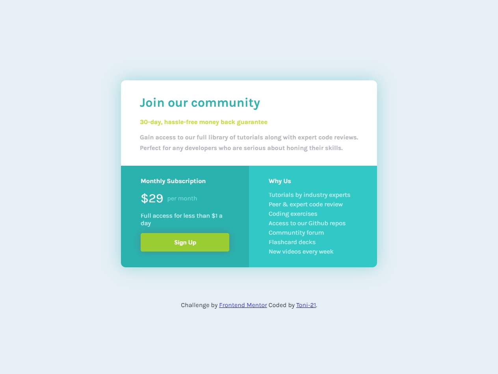

# Frontend Mentor - Single price grid component solution

This is a solution to the [Single price grid component challenge on Frontend Mentor](https://www.frontendmentor.io/challenges/single-price-grid-component-5ce41129d0ff452fec5abbbc). Frontend Mentor challenges help you improve your coding skills by building realistic projects. 

## Table of contents

- [Overview](#overview)
  - [The challenge](#the-challenge)
  - [Screenshot](#screenshot)
  - [Links](#links)
- [My process](#my-process)
  - [Built with](#built-with)

  - [Useful resources](#useful-resources)
- [Author](#author)

## Overview

### The challenge

Users should be able to:

- View the optimal layout for the component depending on their device's screen size
- See a hover state on desktop for the Sign Up call-to-action

### Screenshot

Below there are two screenshots from the project. The first is the visualization if you're using a desktop and the second is the view from a mobile device.

Desktop view screenshot

Mobile view screenshot

### Links

- Solution URL: [Add solution URL here](https://your-solution-url.com)
- Live Site URL: [Add live site URL here](https://your-live-site-url.com)

## My process

### Built with

- Semantic HTML5 markup
- CSS custom properties
- Flexbox

### Useful resources

- [StackOverflow](https://stackoverflow.com/) - With this site, I could solve some specific questions. So I also recommend getting a look at this type of forums before asking some questions.
- [FrontendMentorSlack](https://frontendmentor.slack.com/) - On this platform i was able to get much needed insights abd solutions to this challenge

## Author

- Github - [Toni](https://github.com/toni-21/)
- Frontend Mentor - [Tones](https://www.frontendmentor.io/profile/toni-21)
